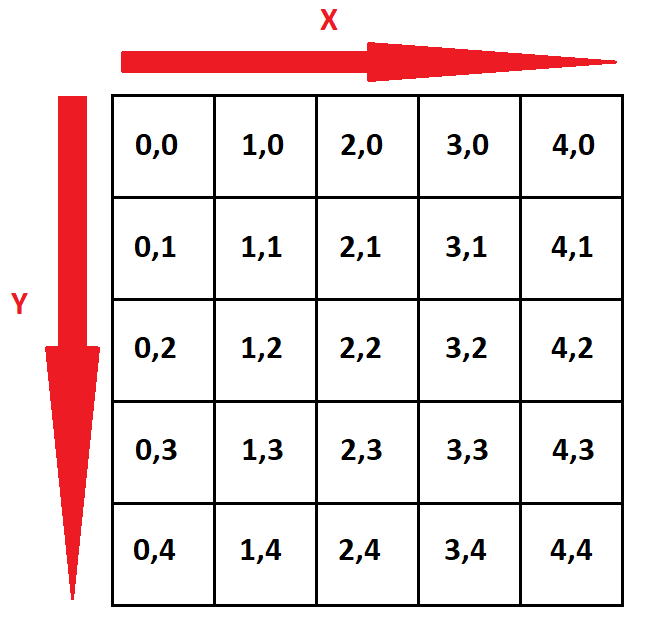
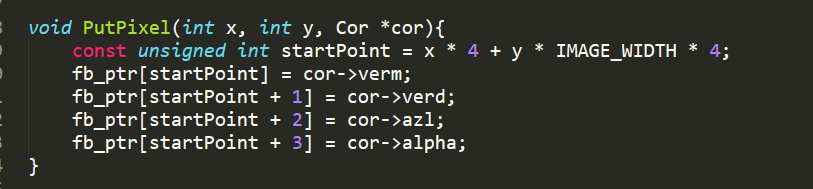
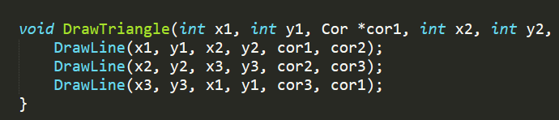
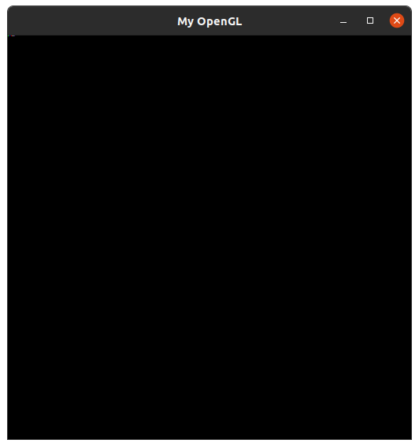
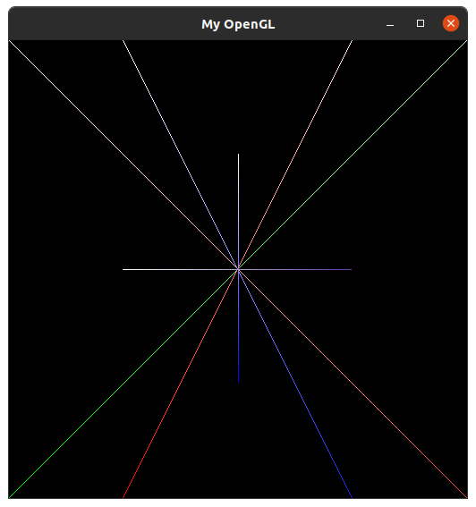

# CG
Atividades de computação grafica: S. SILVA 2016022764  &amp;  G. ALCANTRA 20160110279 

# 01

## Rasterização de Pontos e Linhas

Este trabalho constitui o relatório sobre o primeiro trabalho da disciplina de Introdução à Computação Gráfica, ministrada pelo Prof. Christian Pagot, no período 2019.4.

O trabalho consiste em implementar algoritmos de rasterização para pontos e linhas em liguagem C, juntamente com as bibliotecas GLUT e OpenGL utilizando o Framework disponibilizado previamente pelo professor.

### Introdução
O objetivo principal desta é compreender e desenvolver algorítmos
de rasterização de pontos e linhas. Para linhas, foi implementado
o Algorítmo de Bresenham, que tem como diferencial do cálculo com
números inteiros, poupando memória e processamento.

### Rasterização
Uma tela é basicamente uma matriz. É formada por colunas e linhas
de pixels (a menor unidade de uma tela), onde a origem é o canto
superior esquerdo da tela.

A rasterização consiste em transformar uma imagem vetorial em uma 
imagem de pixels em uma tela. 

	 
	
	<h5 align="center"></h5>
	 

### Pontos
Para rasterizar um ponto basta "pintar" o pixel referente
a sua posição matricial em uma tela.

	 
	
	<h5 align="center"></h5>
	 

---

### Implementação do Algorítimo de Bresenham

O Algorítimo de Bresenham é notoriamente um dos mais populares.
Como dito anteriormente, ele trabalha apenas com números inteiros,
sendo este o seu maior diferencial.

Para este algorítimo, o coeficiente angular da reta é definido
em um intervalo de [-1,1]. Por este motivo, divide-se a implementação
para cada octante de uma circunferência. Além do mais, este algorítimo
trabalha com base em variações de x e y.

 

<h5 align = "center"></ h5>
 
</ p>

## Rasterização de Triângulo
A rasterização de um triângulo ABC, nada mais é do que a rasterização
de linhas entre os vertices AB,BC e CA, utilizando o próprio algorítimo
descrito anteriormente.

	 
	
	<h5 align="center"></h5>
	 

## Problemas encontrados
Como afirmado anteriormente, o Algorítimo de Bresenham trabalha com
base nas variações de x e y. Por este motivo, quando a variação de x
ou a de y é nula, o algorítimo não era capaz de esboçar uma linha
reta. Este problema foi corrigido criando uma extensão da função
DrawLine, que permitiu a rasterização de linhas retas.

---

## Conclusão final
A implementação do Algorítimo de Bresenham foi bem sucedida, gerando
resultados satisfatórios, rasterizando linhas para todos octantes. E
também rasterizando polígonos.

	 
	
	<h5 align="center">Rasterização de Pixels</h5>
	 

	 
	
	<h5 align="center">Rasterização de linhas nos octantes</h5>
	 

	 
	
	<h5 align="center">Rasterização de triângulos e linhas</h5>
	 

---

### Referências

https://en.wikipedia.org/wiki/Bresenham%27s_line_algorithm

